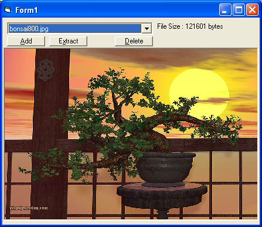



## FSF Archiver

### Description

This app archives (no compression) picture files into one file. Has features for adding extracting and deleting from this archive.
 
### More Info
 
Needs the Archive.fsf file (included in the zip file)

             |
---                |---
**Submitted On**   |2006-06-06 13:38:26
**By**             |[Coenrad](https://github.com/Planet-Source-Code/PSCIndex/blob/master/ByAuthor/coenrad.md)
**Level**          |Intermediate
**User Rating**    |4.7 (14 globes from 3 users)
**Compatibility**  |VB 6\.0
**Category**       |[Graphics](https://github.com/Planet-Source-Code/PSCIndex/blob/master/ByCategory/graphics__1-46.md)
**World**          |[Visual Basic](https://github.com/Planet-Source-Code/PSCIndex/blob/master/ByWorld/visual-basic.md)
**Archive File**   |[FSF\_Archiv2022339292006\.zip](https://github.com/Planet-Source-Code/coenrad-fsf-archiver__1-66667/archive/master.zip)

